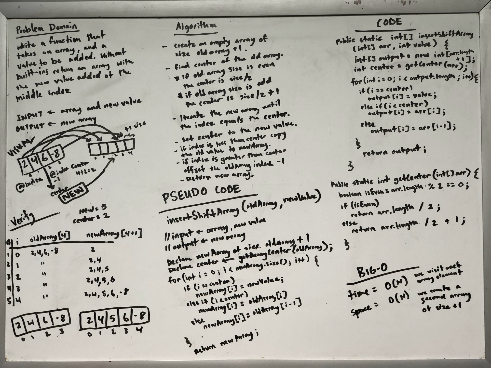

# Insert to Middle of an Array

Write a function called `insertShiftArray` which takes an array and a new value to be added as an argument. Without utilizing any of the built-in methods available to your language, return an array with the new value added to the middle index.

## Whiteboard Process

[](./array-insert-shift.jpg)

<style>
  img {
    max-width: 80%;
  }
</style>

## Approach & Efficiency

Because the size of the array will increase we don't have an option with arrays to make this change in place. I realized we need to identify what the center index for the new element will be as an initial step. With this we can copy the array to the new array until the current position is equal to the center. The center become the new value, and then to copy the rest of the initial array we need to offset the reference by one so we target the initial array's remaining element with the index minus one.

According to the example data the midpoint index to place the new element would go exactly in the middle in the case of an evenly sized array becoming an odd sided array, and in case of an odd sized array the 

### Big O space/time

This algorithm runs in O(N) time complexity since we always need to iterate the whole array.

The space complexity is also 0(N) because we need to essentially make a duplicate array (plus one).

### Code

```java
public static int[] insertShiftArray(int[] arr, int value) {
    int[] output = new int[arr.length + 1];
    int center = getCenter(arr);
    for (int i = 0; i < output.length; i++) {
        if (i == center)
            output[i] = value;
        else if (i < center) 
            output[i] = arr[i];
        else
            output[i] = arr[i - 1];
    }
    return output;
}

public static int getCenter(int[] arr) {
    boolean isEven = arr.length % 2 == 0;
    if (isEven)
        return arr.length / 2;
    else
        return arr.length / 2 + 1;
}

```
