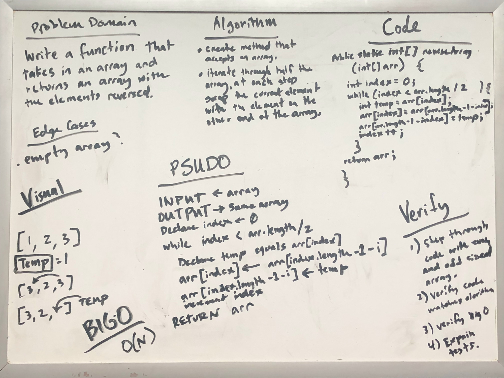

# Reverse an Array

Write a function called `reverseArray` which takes an array as an argument. Without utilizing any of the built-in methods available to your language, return an array with elements in reversed order.

## Whiteboard Process

[](./reverse-array-whiteboard.jpg)

<style>
  img {
    max-width: 80%;
  }
</style>

## Approach & Efficiency

I decided to change the array in place because the name of the function `reverseArray`, to me, implies this. I chose to iterate through the first half of the array and swap the current element with the element at the other end of the array i.e. the third element swaps with the element three from the end of the array. 

### Big O space/time

This algorithm runs in O(N) time complexity since the size of the array directly impacts the time it takes to run and we will always need to touch half or half minus one of the elements in the array.

Reversing the array in place means we don't need extra disk space aside from variable to keep track of the index.

### Thoughts

I know that traditional arrays occupy contiguous space in memory and each element is the same size, the only way I can see at present to reverse the array more efficiently would be to change the location of the starting element in memory to the last element and then somehow make sure this array is read backwards. This would result in an algorithm that could run in constant time but I don't think there is a way to implement this.

### Code

```java

public static int[] reverseArray(int[] arr) {
  int index = 0;
  while(index < arr.length / 2) {
    int temp = arr[index];
    arr[index] = arr[index - 1 - index];
    arr[index - 1 - index] = temp;
    index++;
  }
  return arr;
}

```
