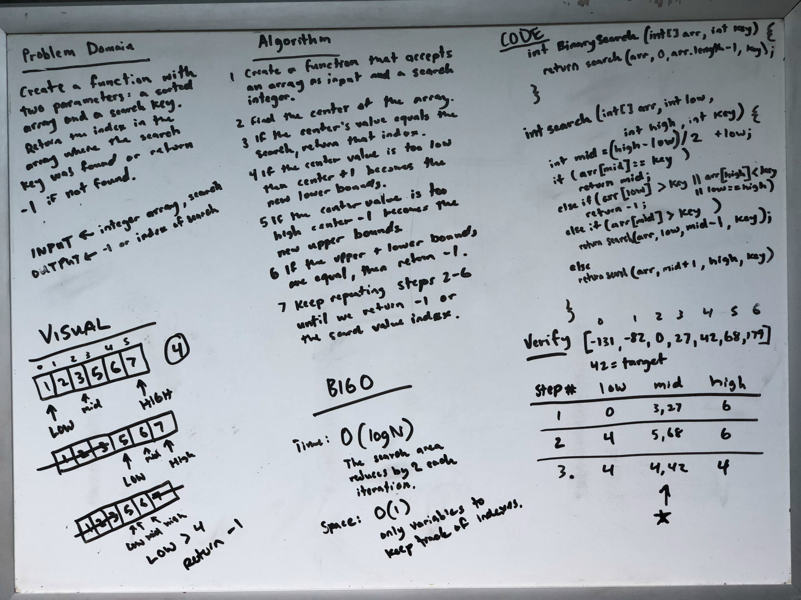

# Binary Search of Sorted Array

Write a function called BinarySearch which takes in 2 parameters: a sorted array and the search key. Without utilizing any of the built-in methods available to your language, return the index of the array’s element that is equal to the value of the search key, or -1 if the element is not in the array.

## Whiteboard Process

[](./array-binary-search.jpg)

<style>
  img {
    max-width: 80%;
  }
</style>

## Approach & Efficiency

 I decided to implement a recursive function because the algorithm I came up with was reducing the search area by half each step and it felt very recurive in nature. I needed to carry a few more variable with me during each recursive loop so I made another function that the BinarySearch function called.

### Big O space/time

Because the size of the array that is being searched gets cut in half in each iteration of the recusive loop the time complexity is logrithmic: O(log N).

The space complexity O(1) auxiliary space.


### Code

```java
int BinarySearch (int[] arr, int key) {
  return search(arr, 0, arr.length - 1, key);
}

int search(int[] arr, int low, int high, int key) {
  int mid = (high - low) / 2 + low;
  if (arr[mid] == key)
    return mid;
  else if (arr[low] > key || arr[high] < key || low == high)
    return -1;
  else if (arr[mid] > key)
    return search(arr, low, mid - 1, key);
  else return search(arr, mid + 1, high, key);
}


```
