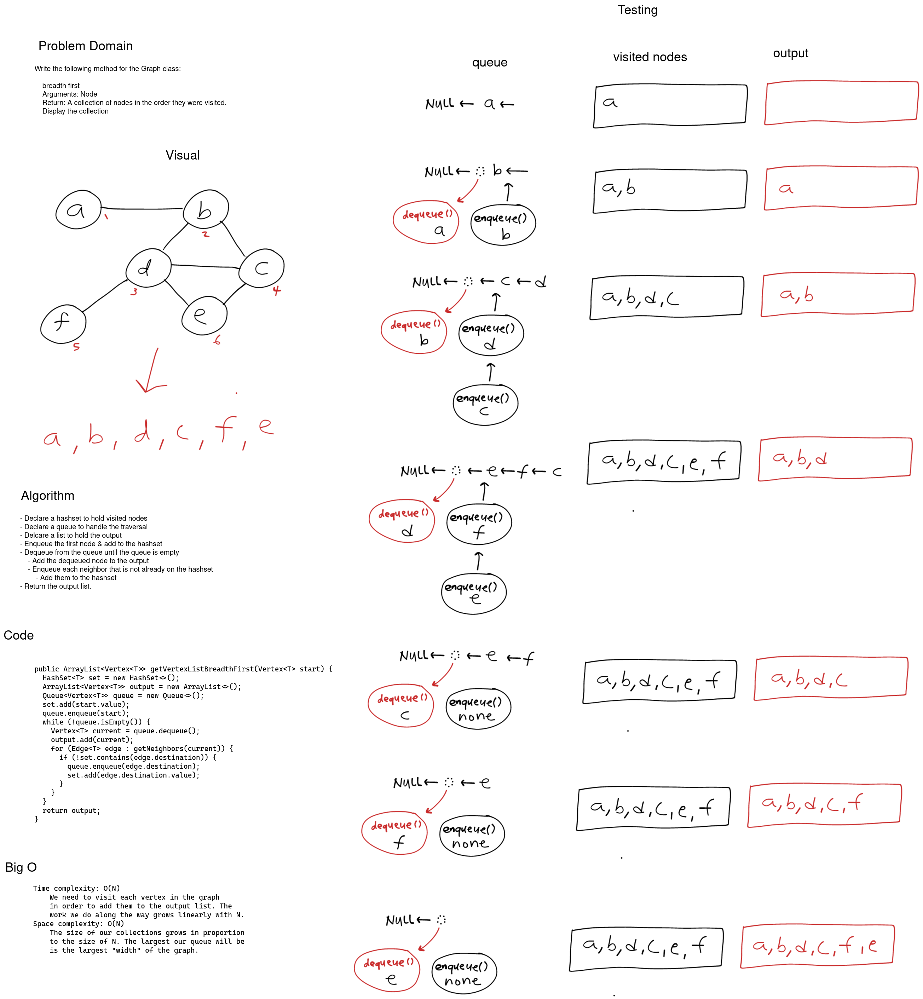

# Extending a Graph -- Breadth-First Traversal

Extend a graph to include a breadth-first traversal that returns a collection of nodes.

**Unit Tests**

1. Can successfully traverse example graph from various points.
2. Can successfully traverse a graph with a single node.
3. Can successfully traverse a graph of a single line from the front.
4. Can successfully traverse a graph of a single line from the middle.

## Whiteboard Process

[](images/graph-breadth-first.png)

<style>
  img {
    max-width: 80%;
  }
</style>

## Approach & Efficiency

To traverse the graph breadth first we use a queue. To begin we enqueue the starting node and add it to the output list and a set of visited nodes. Next we dequeue the head, and look at the neighbors. If the neighbor isn't in the visited set then we add it to the set and enqueue it in the queue. We continue to dequeue nodes in this manner until the queue is empty. At that time we can return the list of visited nodes. Using a queue in this way ensures that we get a breadth first list because we list each node's neighbors before we coninue.

Because we need to visit each node in order to add it to the output list we require a time complexity of O(N). As N grows our time to traverse grows linearly. For space we use O(N) space complexity because the size of the containers grow directly with N.


### Code

```java
public ArrayList<Vertex<T>> getVertexListBreadthFirst(Vertex<T> start) {
  HashSet<T> set = new HashSet<>();
  ArrayList<Vertex<T>> output = new ArrayList<>();
  Queue<Vertex<T>> queue = new Queue<>();
  set.add(start.value);
  queue.enqueue(start);
  while (!queue.isEmpty()) {
    Vertex<T> current = queue.dequeue();
    output.add(current);
    for (Edge<T> edge : getNeighbors(current)) {
      if (!set.contains(edge.destination.value)) {
        queue.enqueue(edge.destination);
        set.add(edge.destination.value);
      }
    }
  }
  return output;
}
```

