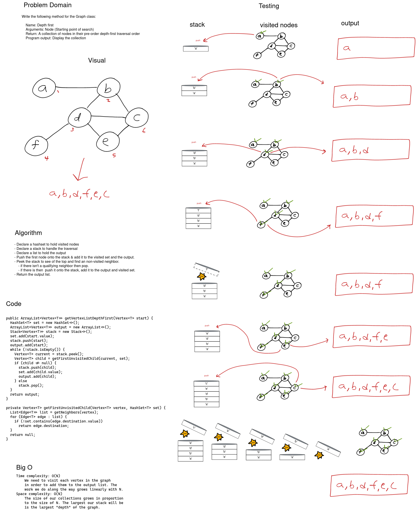

# Extending a Graph -- Depth-First Traversal

Extend a graph to include a depth-first traversal that returns a collection of nodes.

**Unit Tests**

1. Can successfully traverse example graph from various points.
2. Can successfully traverse a graph with a single node.
3. Can successfully traverse a graph of a single line from the front.
4. Can successfully traverse a graph of a single directed edge.

## Whiteboard Process

[](images/graph-depth-first.png)

<style>
  img {
    max-width: 80%;
  }
</style>

## Approach & Efficiency

To traverse the graph depth first I chose to use a stack. To begin we push the starting node on the stack and add it to the output list and a set of visited nodes. Next we peek at the stack to get the top vertex. If this vertex has a neighbor we haven't visited then we grab one (only one) and push it onto the stack, add it to the output list and to the visited set. If there isn't one then we pop the stack. Following this pattern we will be sure to follow a path from destination to destination instead of visiting each neighbor before moving on (like a breadth first traversal).

Because we need to visit each node in order to add it to the output list we require a time complexity of O(N). As N grows our time to traverse grows linearly. For space we use O(N) space complexity because the size of the containers grow directly with N.


### Code

```java
public ArrayList<Vertex<T>> getVertexListDepthFirst(Vertex<T> start) {
  HashSet<T> set = new HashSet<>();
  ArrayList<Vertex<T>> output = new ArrayList<>();
  Stack<Vertex<T>> stack = new Stack<>();
  set.add(start.value);
  stack.push(start);
  output.add(start);
  while (!stack.isEmpty()) {
    Vertex<T> current = stack.peek();
    Vertex<T> child = getFirstUnvisitedChild(current, set);
    if (child != null) {
      stack.push(child);
      set.add(child.value);
      output.add(child);
    } else
      stack.pop();
  }
  return output;
}

private Vertex<T> getFirstUnvisitedChild(Vertex<T> vertex, HashSet<T> set) {
  List<Edge<T>> list = getNeighbors(vertex);
  for (Edge<T> edge : list) {
    if (!set.contains(edge.destination.value))
      return edge.destination;
  }
  return null;
}
```

