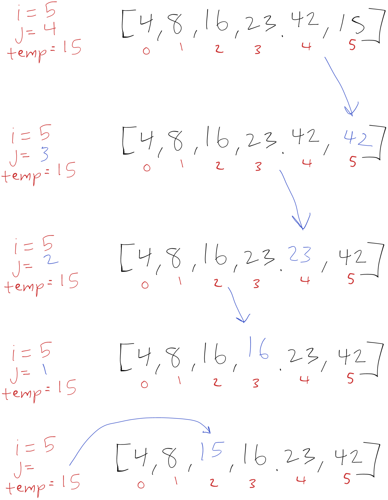

<style>
  img {
    max-width: 80%;
  }
</style>

# Insertion Sort

Insertion sort is a sorting algorithm for sorting elements in an array. The algorithm iterates through the array beginning at the second element. On each iteration the current element is saved. Then the previous elements are compared and the current element is shifted earlier in the array until it is at the beginning of the array or the value before it is equal or larger in value. 

## Pseudocode

```
  InsertionSort(int[] arr)

    FOR i = 1 to arr.length

      int j <-- i - 1
      int temp <-- arr[i]

      WHILE j >= 0 AND temp < arr[j]
        arr[j + 1] <-- arr[j]
        j <-- j - 1

      arr[j + 1] <-- temp
```

## Trace

Here is an example array we'll work through to show the process: `[8,4,23,42,16,15]`. Each image along the way will show what happens as `i` increases.

[](./images/insertion-sort-blog/insertion-sort-01.png)

### i = 1

Initially `i` begins at 1 so we save 4 as `temp`. Next we compare 4 at index 1 with 8 at index 0. 8 is larger than 4 so we overwrite the 4 with 8, leaving index 0 and index 1 with the value of 8. We decrease `j` and then exit the while loop because `j` decrements to -1. Last we place `temp` at index 0.

[](./images/insertion-sort-blog/insertion-sort-02.png)

### i = 2

Next we save our `temp` variable of 23. Then we compare 23 and 8. Since 23 is larger than 8, it's already sorted and we can continue. We save our temp variable back where we took it from (index 2).

[](./images/insertion-sort-blog/insertion-sort-03.png)

### i = 3

We save our next `temp` as 42 and now we're comparing 42 and 23. Again this is sorted already so we save our temp and continue.

[](./images/insertion-sort-blog/insertion-sort-04.png)

### i = 4

Now our `temp` is 16 and we're comparing 16 and 42. 42 is larger so we overwrite index 4 (16) with 42. We now check the previous value of 23, this is also larger than 16 so we overwrite index 3 (42) with 23. Now we check the previous value of 8, this is smaller than 16 so we stop here. 

To wrap up this iteration we write our `temp` value of 16 to index 2 (23) and move on to the next iteration.

[](./images/insertion-sort-blog/insertion-sort-05.png)

### i = 5

This is our last increment of `i`. We save 15 in our `temp` variable and compare 42 and 15. 42 is larger so we overwrite index 5 (15) with 42. Next we compare 15 with 23, 23 is larger so we overwrite index 4 (42) with 23. Now we compare 15 with 16, 16 is larger so we overwrite index 3 (23) with 16. And last we compare 15 with 8, 15 is larger so we finish this iteration and write 15 to index 2 (16).

[](./images/insertion-sort-blog/insertion-sort-06.png)

### end

After the iteration is complete we finish with a sorted array.

[](./images/insertion-sort-blog/insertion-sort-07.png)

## Efficiency

- Time: O(N^2)
  - In the best case that the array is already sorted we would only visit each element once for a time efficacy of O(N), but in the worst case -- the case that counts for Big O, we need to compare each element (N * N-1) or N^2.
- Space O(1)
  - No additional space is used since the array is being mutated and sorted in place.
