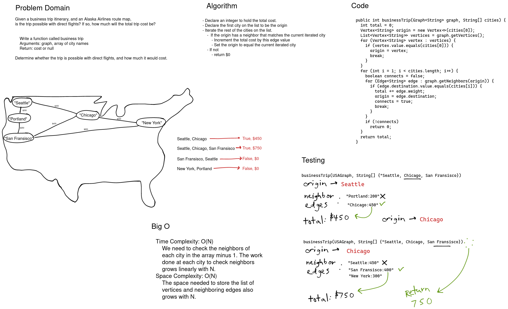

# Challenge Summary

Given a business trip itinerary, and an Alaska Airlines route map, is the trip possible with direct flights? If so, how much will the total trip cost be?

## Whiteboard Process

[](../../../../../images/graph-business-trip.png)

<style>
  img {
    max-width: 80%;
  }
</style>

## Approach & Efficiency

To find the total cost of a trip given a graph of nodes and a list of cities we need to iterate the list of cities and check to see if the origin has an edge with the destination. If it does then add the weight of the edge and make the destination the origin and proceed. If it doesn't have an edge then return 0. If we get to then of the list of cities we can return the total at that point knowing that there is a connection. This algorithm allows for duplicates so a business trip could be a round trip or visit nodes more than one time.

We need to check the neighbors of each city in the array minus 1. The work done at each city to check neighbors grows linearly with N making the time complexity O(N). The space needed to store the list of vertices and neighboring edges also grows with N.

## Code

```java
public int businessTrip(Graph<String> graph, String[] cities) {
  int total = 0;
  if (cities.length < 2)
    return 0;
  Vertex<String> origin = new Vertex<>(cities[0]);
  List<Vertex<String>> vertices = graph.getVertices();
  for (Vertex<String> vertex : vertices) {
    if (vertex.value.equals(cities[0])) {
      origin = vertex;
      break;
    }
  }
  for (int i = 1; i < cities.length; i++) {
    boolean connects = false;
    for (Edge<String> edge : graph.getNeighbors(origin)) {
      if (edge.destination.value.equals(cities[i])) {
        total += edge.weight;
        origin = edge.destination;
        connects = true;
        break;
      }
    }
    if (!connects)
      return 0;
  }
  return total;
}

```
