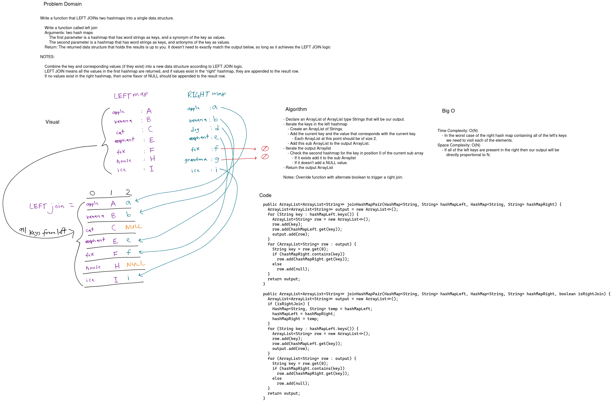

# Challenge Summary

Implement a simplified LEFT JOIN for 2 Hashmaps.

## Whiteboard Process

[](../../../../../images/hashmap-left-join.png)

<style>
  img {
    max-width: 80%;
  }
</style>


## Approach & Efficiency

I used an ArrayList of ArrayLists to simplify adding new values and dealing with the size. Indexes 0 and 1 are used for the left's key and value and index 2 is used for the matching right hashmap's value if it exists.

To complete the join we need to visit each element on each hashmap. The work done at each iteration does not change in size as N grows making our time complexity O(N).

The output ArrayList is the only extra space that changes with N. In the worst case of all the values being added to the ArrayList we get a space complexity of O(N).


## Code

```java
// Left join
public ArrayList<ArrayList<String>> joinHashMapPair(HashMap<String, String> hashMapLeft, HashMap<String, String> hashMapRight) {
  ArrayList<ArrayList<String>> output = new ArrayList<>();
  for (String key : hashMapLeft.keys()) {
    ArrayList<String> row = new ArrayList<>();
    row.add(key);
    row.add(hashMapLeft.get(key));
    output.add(row);
  }
  for (ArrayList<String> row : output) {
    String key = row.get(0);
    if (hashMapRight.contains(key))
      row.add(hashMapRight.get(key));
    else
      row.add(null);
  }
  return output;
}

// Override with optional boolean for right join
public ArrayList<ArrayList<String>> joinHashMapPair(HashMap<String, String> hashMapLeft, HashMap<String, String> hashMapRight, boolean isRightJoin) {
  ArrayList<ArrayList<String>> output = new ArrayList<>();
  if (isRightJoin) {
    HashMap<String, String> temp = hashMapLeft;
    hashMapLeft = hashMapRight;
    hashMapRight = temp;
  }
  for (String key : hashMapLeft.keys()) {
    ArrayList<String> row = new ArrayList<>();
    row.add(key);
    row.add(hashMapLeft.get(key));
    output.add(row);
  }
  for (ArrayList<String> row : output) {
    String key = row.get(0);
    if (hashMapRight.contains(key))
      row.add(hashMapRight.get(key));
    else
      row.add(null);
  }
  return output;
}


```
