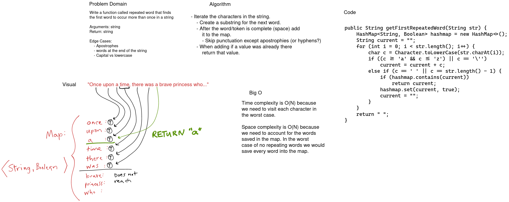

# Challenge Summary

Find the first repeated word in a string.

## Whiteboard Process

[](../../../../../images/hashmap-repeated-word.png)

<style>
  img {
    max-width: 80%;
  }
</style>


## Approach & Efficiency

To check each word we need to define the token that represents a word. Each word will be at least one letter that ends with a space, except for the last work in the string. Punctuation except for apostrophes should be skipped entirely. The comparisons should also be case insensitive. A hashmap with the words as a key will work well to determine if a key is unique. We just need to check if a key already exists and the first time that happens we return that key.

The time complexity to check for the first repeated word will be O(N) because in the worst case we need to check the entire string.

The space complexity will be determined by the size of the map. If we traverse the entire string (worst case) then the space complexity will be O(N) as the map will need to hold all the words in the string.

## Code

```java
  public String getFirstRepeatedWord(String str) {
    HashMap<String, Boolean> hashmap = new HashMap<>();
    String current = "";
    for (int i = 0; i < str.length(); i++) {
      char c = Character.toLowerCase(str.charAt(i));
      if ((c >= 'a' && c <= 'z') || c == '\'')
        current = current + c;
      else if (c == ' ' || i == str.length() - 1) {
        if (hashmap.contains(current))
          return current;
        hashmap.set(current, true);
        current = "";
      }
    }
    return "";
  }
```

