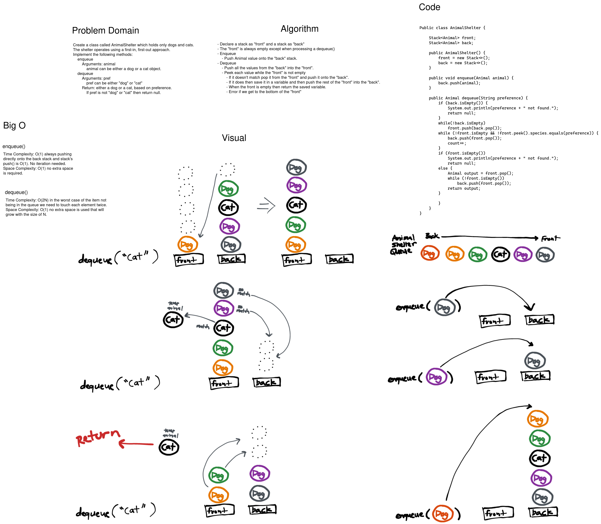

# Challenge Summary

Create a class Animal Shelter that can hold only dogs or cats. The animal shelter holds animals with "first-in first-out" approach. Make an enqueue() method and a dequeue() method. The enqueue method adds a animal (dog/cat) to the animal shelter. The dequeue takes a cat/dog preference argument and returns the first one it finds from the queue.

## Whiteboard Process

[](../../../../../images/stack-queue-animal-shelter.png)

<style>
  img {
    max-width: 80%;
  }
</style>


## Approach & Efficiency

To represent the animal shelter with two stacks. I designated one stack as the front, that will always be empty except for processing the dequeue(). The back stack is where new elements get pushed as they enter the queue. To dequeue all the animals in the back stack get popped off into the front stack (reversing their order). Then while the front stack is not empty we peek() at each animal and if the species doesn't match the preference then it gets moved to the back stack. If it does it gets saved while the rest of the front stack gets moved to the back. Then the saved animal gets returned.

Enqueue elements can be directly pushed onto the back stack and since the underlying stack has a time complexity of O(1) for pushing, the animal shelter has a O(1) time complexity for enqueue.

To dequeue the best case is O(N) and the worst case we need to touch each value twice creating O(2N) time complexity.

Both methods do not use any other data structures and do not use more disk space as N increases: O(1).

## Code

```java
public class Animal {

  String species;
  public Animal(String species) {
    this.species = species;
  }

  public String getSpecies() {
    return species;
  }
}


public class AnimalShelter {

  Stack<Animal> front;
  Stack<Animal> back;
  int size;

  public AnimalShelter() {
    front = new Stack<>();
    back = new Stack<>();
  }

  public void enqueue(Animal animal) {
    back.push(animal);
    size++;
  }

  public Animal dequeue(String preference) {
    if (back.isEmpty()) {
      System.out.println(preference + " not found.");
      return null;
    }
    while(!back.isEmpty())
      front.push(back.pop());
    while (!front.isEmpty() && !front.peek().species.equals(preference))
      back.push(front.pop());
    if (front.isEmpty()) {
      System.out.println(preference + " not found.");
      return null;
    } else {
      Animal output = front.pop();
      while (!front.isEmpty())
        back.push(front.pop());
      size--;
      return output;
    }
  }

  public int size() {
    return size;
  }
}

```

