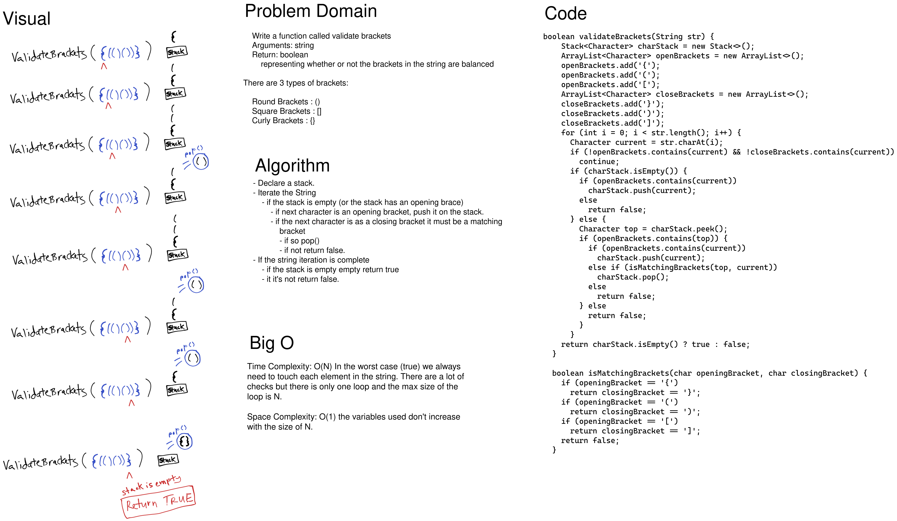

# Challenge Summary

Write a function *validateBrackets()* that accepts a string and returns a boolean. Validate brackets returns true if the brackets in the string are properly nested e.g. `({}[])` returns true and `()]` return false.

## Whiteboard Process

[](../../../../../images/stack-queue-brackets.png)

<style>
  img {
    max-width: 80%;
  }
</style>


## Approach & Efficiency

I chose to iterate the input string and push opening brackets onto the stack ignoring all characters aside from brackets. If a closing bracket came up in the string and matched the top of the stack then I popped the top element off the stack. If it didn't match or I got to the end of the string and there were still items left I returned false. If I got to the end of the string and the stack is empty then everything matched and I returned true.

For matching the brackets I used a separate function to make things a little easier to read. I also used two ArrayLists to hold the opening brackts and the closing brackets allowing me to use the ".contains" method making the code more readable as well.

The worst cast for time complexity is iterating the entire string making it O(N).

The space required for keeping track of elements does not grow as N grows so the space complexity is O(1).


## Code

```java
boolean validateBrackets(String str) {
    Stack<Character> charStack = new Stack<>();
    ArrayList<Character> openBrackets = new ArrayList<>();
    openBrackets.add('{');
    openBrackets.add('(');
    openBrackets.add('[');
    ArrayList<Character> closeBrackets = new ArrayList<>();
    closeBrackets.add('}');
    closeBrackets.add(')');
    closeBrackets.add(']');
    for (int i = 0; i < str.length(); i++) {
      Character current = str.charAt(i);
      if (!openBrackets.contains(current) && !closeBrackets.contains(current))
        continue;
      if (charStack.isEmpty()) {
        if (openBrackets.contains(current))
          charStack.push(current);
        else
          return false;
      } else {
        Character top = charStack.peek();
        if (openBrackets.contains(top)) {
          if (openBrackets.contains(current))
            charStack.push(current);
          else if (isMatchingBrackets(top, current))
            charStack.pop();
          else
            return false;
        } else
          return false;
        }
      }
    return charStack.isEmpty() ? true : false;
  }

  boolean isMatchingBrackets(char openingBracket, char closingBracket) {
    if (openingBracket == '{')
      return closingBracket == '}';
    if (openingBracket == '(')
      return closingBracket == ')';
    if (openingBracket == '[')
      return closingBracket == ']';
    return false;
  }
```
