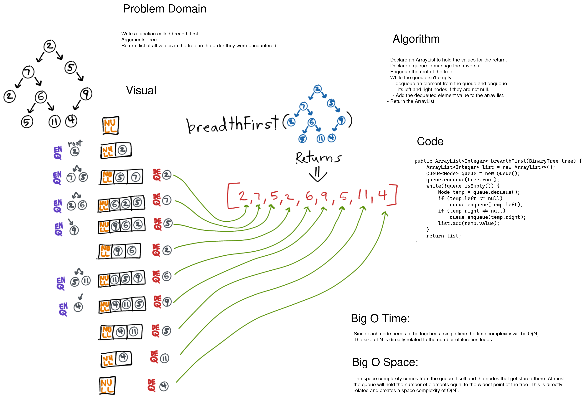

# Challenge Summary

Write a function that returns a list of values of a binary tree via breadth first traversal.

## Whiteboard Process

[](../../../../../images/tree-breadth-first.png)

<style>
  img {
    max-width: 80%;
  }
</style>


## Approach & Efficiency

To get the value from each node of the tree we need to touch each node. The time complexity will be O(N) for this reason. For the space complexity a breadth-first approach with a queue yeilds a O(N). The width of the widest point on the tree is the most elements that will be in the queue at any point in time during iteration.

## Code

```java
  public ArrayList<Integer> breadthFirst(BinaryTree<Integer> tree) {
      ArrayList<Integer> list = new ArrayList<>();
      Queue<Node<Integer>> queue = new Queue<>();
      if (tree.root != null)
        queue.enqueue(tree.root);
      while(!queue.isEmpty()) {
        Node<Integer> temp = queue.dequeue();
        if (temp.left != null)
          queue.enqueue(temp.left);
        if (temp.right != null)
          queue.enqueue(temp.right);
        list.add( temp.value);
      }
      return list;
  }
```


