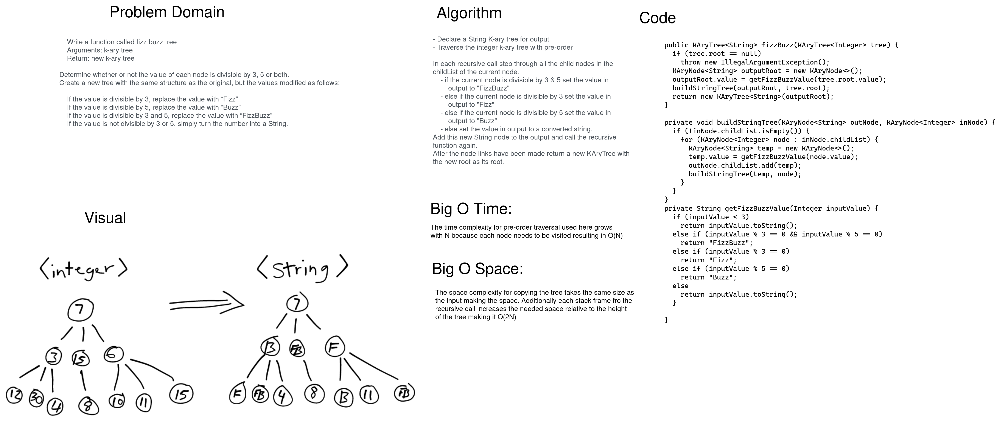

# Challenge Summary

Write a function that conducts "FizzBuzz" on a k-ary tree. Return a new k-ary tree with Strings except change the values according to "FizzBuzz" rules:

- If the value is divisible by 3, replace the value with “Fizz”
- If the value is divisible by 5, replace the value with “Buzz”
- If the value is divisible by 3 and 5, replace the value with “FizzBuzz”
- If the value is not divisible by 3 or 5, simply turn the number into a String.


## Whiteboard Process

[](../../../../../images/tree-fizz-buzz.png)

<style>
  img {
    max-width: 80%;
  }
</style>


## Approach & Efficiency

For this challenge I added new KAryNode and KAryTree classes to the datascructures package. The KAryNode uses an ArrayList to manage each node's children. The method **void addChild(KAryNode<T> node)** can be used to add values to the internal childList.

To make a copy of the input tree we need to visit each node. This makes our time complexity O(N). The space complexity for running this function requires another tree of the same number of nodes plus the space taken via the traversal using recursion makes the Big O for space O(2N). The number of stack frames is related to the height of the tree but is proportional to N as it grows.

## Code

```java
  public KAryTree<String> fizzBuzz(KAryTree<Integer> tree) {
    if (tree.root == null)
      throw new IllegalArgumentException();
    KAryNode<String> outputRoot = new KAryNode<>();
    outputRoot.value = getFizzBuzzValue(tree.root.value);
    buildStringTree(outputRoot, tree.root);
    return new KAryTree<String>(outputRoot);
  }


  private void buildStringTree(KAryNode<String> outNode, KAryNode<Integer> inNode) {
    if (!inNode.childList.isEmpty()) {
      for (KAryNode<Integer> node : inNode.childList) {
        KAryNode<String> temp = new KAryNode<>();
        temp.value = getFizzBuzzValue(node.value);
        outNode.childList.add(temp);
        buildStringTree(temp, node);
      }
    }
  }

  private String getFizzBuzzValue(Integer inputValue) {
    if (inputValue < 3)
      return inputValue.toString();
    else if (inputValue % 3 == 0 && inputValue % 5 == 0)
      return "FizzBuzz";
    else if (inputValue % 3 == 0)
      return "Fizz";
    else if (inputValue % 5 == 0)
      return "Buzz";
    else
      return inputValue.toString();
    }
```


