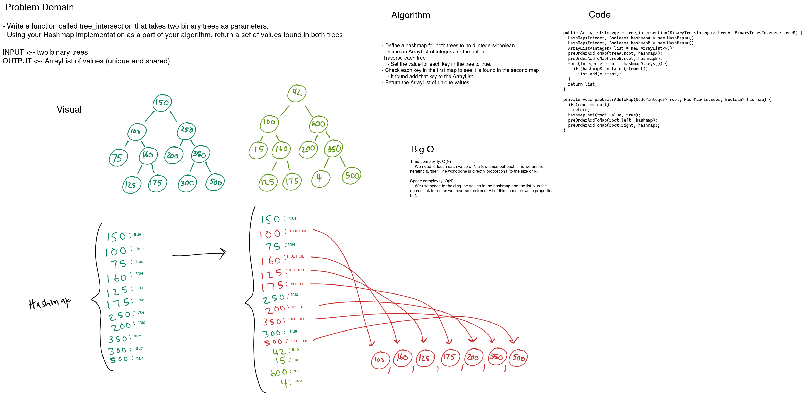

# Challenge Summary

Find common values in 2 binary trees.

## Whiteboard Process

[](../../../../../images/tree-intersection.png)

<style>
  img {
    max-width: 80%;
  }
</style>


## Approach & Efficiency

We can use a hashmap to find only the unique values in a tree then compare the keys from one tree and see if they are present in the second. Any key that is present in both can be added to the return.

We need to touch each value of N a few times but each time we are not iterating further. The work done is directly proportional to the size of N making the time complexity O(N).
  
We use space for holding the values in the hashmap and the list plus the each stack frame as we traverse the trees. All of this space grows in proportion to N making the space complexity also O(N).

## Code

```java
  public ArrayList<Integer> tree_intersection(BinaryTree<Integer> treeA, BinaryTree<Integer> treeB) {
    HashMap<Integer, Boolean> hashmapA = new HashMap<>();
    HashMap<Integer, Boolean> hashmapB = new HashMap<>();
    ArrayList<Integer> list = new ArrayList<>();
    preOrderAddToMap(treeA.root, hashmapA);
    preOrderAddToMap(treeB.root, hashmapB);
    for (Integer element : hashmapA.keys()) {
      if (hashmapB.contains(element))
        list.add(element);
    }
    return list;
  }

  private void preOrderAddToMap(Node<Integer> root, HashMap<Integer, Boolean> hashmap) {
    if (root == null)
      return;
    hashmap.set(root.value, true);
    preOrderAddToMap(root.left, hashmap);
    preOrderAddToMap(root.right, hashmap);
  }
```
