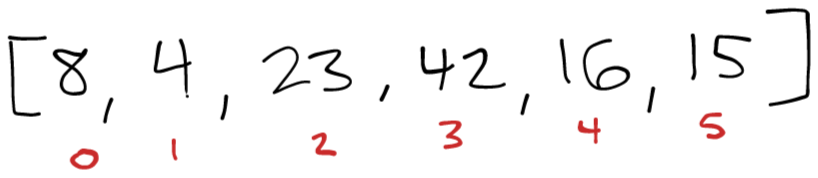

<style>
  img {
    max-width: 80%;
  }
</style>

# Merge Sort

Merge sort is a sorting algorithm for sorting elements in an array. The algorithm consists of two functions. The first function splits the array in half recursively until the sub-arrays consist of a single element. After the left and right halves of the array have been reduced to single element arrays the second function sorts each sub array. Since the the sub-arrays are broken down to a single element the second function can assume that each array is sorted and zips them together on each call. As the first recursive function begins popping its calls off the stack the sorted sub-arrays are joined back together.

## Pseudocode

```
ALGORITHM Mergesort(arr)
    DECLARE n <-- arr.length

    if n > 1
      DECLARE mid <-- n/2
      DECLARE left <-- arr[0...mid]
      DECLARE right <-- arr[mid...n]
      // sort the left side
      Mergesort(left)
      // sort the right side
      Mergesort(right)
      // merge the sorted left and right sides together
      Merge(left, right, arr)

ALGORITHM Merge(left, right, arr)
    DECLARE i <-- 0
    DECLARE j <-- 0
    DECLARE k <-- 0

    while i < left.length && j < right.length
        if left[i] <= right[j]
            arr[k] <-- left[i]
            i <-- i + 1
        else
            arr[k] <-- right[j]
            j <-- j + 1

        k <-- k + 1

    if i = left.length
       set remaining entries in arr to remaining values in right
    else
       set remaining entries in arr to remaining values in left

```

## Trace

Here is an example array we'll work through to show the process: `[8,4,23,42,16,15]`. Each image along the way will show what happens as the recursive calls are put onto and popped off of the stack.

[](./images/merge-sort-blog/merge-sort-01.png)

### Initial call to mergeSort()

The first call splits the original array into left and right and calls mergeSort() again on the left side [8, 4, 23]. We need to wait for these results before we can continue.


[](./images/merge-sort-blog/merge-sort-02.png)

### Left [8, 4, 23] call to mergeSort()

The left recursive call splits the left [8, 4, 23] into a left and right and calls mergeSort() again on the sub-left side [8] and returns because [8] has a length of 1. Back to the first left call of mergeSort() we continue.

[](./images/merge-sort-blog/merge-sort-03.png)


### First Right Calls to mergeSort()

Next we finally use a right sub-array [4, 23]. This is split into a left [4] and a right [23] and then mergeSort is called on the left [4] which returns, and then is called on the right [23] which returns. Back to the first left call to mergeSort() we continue to the first merge() call.

[](./images/merge-sort-blog/merge-sort-04.png)

### First call to merge() 

Finally we can perform our first merge() call. At this step the sub-array is already sorted [4, 23] so the same values are overwritten and there is no change. Back to the first left call to mergeSort() we continue.


[](./images/merge-sort-blog/merge-sort-05.png)

### Second call to merge()

In the last line of the first left call to mergeSort() we call to merge() with [8] and [4, 23] and the sub-array looking like [8, 4, 23]. After performing the sort our sub-array is sorted [4, 8, 23]. Back to the original call to mergeSort() we continue.

[](./images/merge-sort-blog/merge-sort-06.png)

### Back to the First Call of mergeSort()

Back in the original call to mergeSort() we are now calling mergeSort() again with the original right of [42, 16, 15]. This process plays out just like the left half did and after those recursive calls unwind we continue with a sorted right of [15, 16, 42]

[](./images/merge-sort-blog/merge-sort-07.png)

### Finishing up 

Back again in the original call we invoke merge() with the two sorted sub-arrays [4, 8, 23] and [15, 16, 42]. After merge() processes them we are left with a fully sorted array [4, 8, 15, 16, 23, 42].

[](./images/merge-sort-blog/merge-sort-08.png)

## Efficiency

- Time: O(N log N)
  - In each recursive call the elements that need to be visited reduce by half. The number of levels required to reduce N to a single element is the number of recursive calls needed. This number is logarithmic or log N. Since the number of recursive calls is log N and the elements to be visited on each call is proportional to N this makes the Big O complexity for time O(N log N). 
- Space: O(N)
  - The space requirements of the sub arrays add up to N in each recursive call. Since we know there are log N number of recursive calls then the space required is O(N) + O(log N) which reduces to O(N).

## Code 

```java
  void mergeSort(int[] arr) {

    int n = arr.length;
    if (n <= 1)
      return;
    int[] left = new int[n / 2];
    int[] right = new int[(n / 2) + (n % 2)];
    int leftIndex = 0;
    int rightIndex = 0;

    for (int i = 0; i < arr.length; i++) {
      if (i < n / 2)
        left[leftIndex++] = arr[i];
      else
        right[rightIndex++] = arr[i];
    }
    mergeSort(left);
    mergeSort(right);
    merge(left, right, arr);
  }

  void merge(int[] left, int[] right, int[]arr) {
    int i, j, k;
    i = j = k = 0;
    while (i < left.length && j < right.length) {
      if (left[i] <= right[j])
        arr[k++] = left[i++];
      else
        arr[k++] = right[j++];
    }
    while (i < left.length)
      arr[k++] = left[i++];
    while (j < right.length)
      arr[k++] = right[j++];
  }
```
