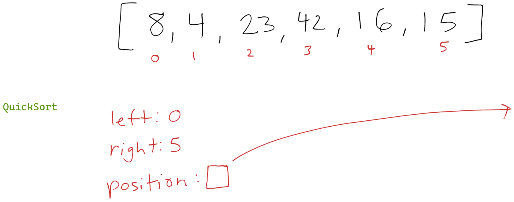
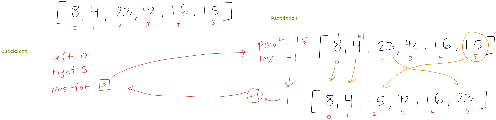
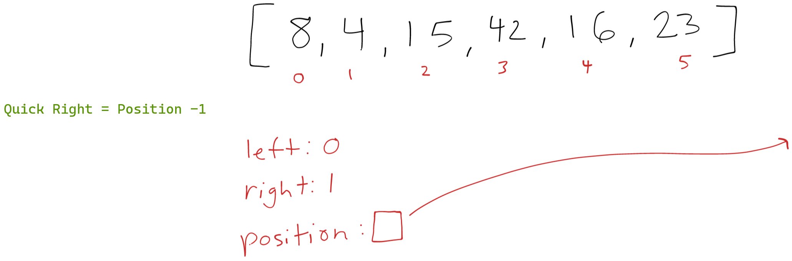
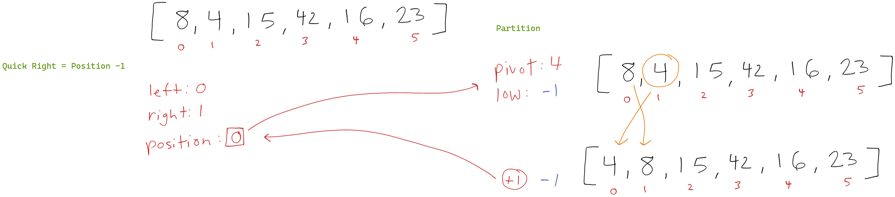
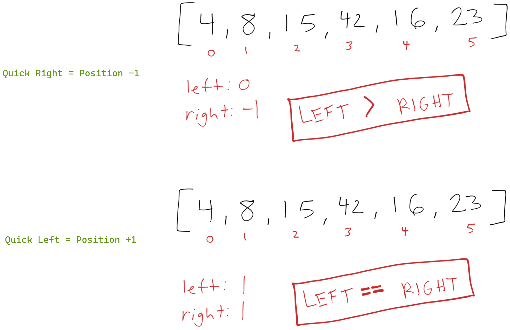
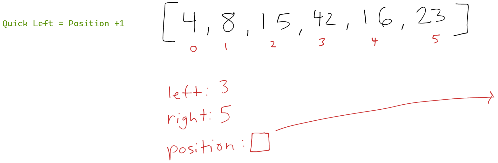
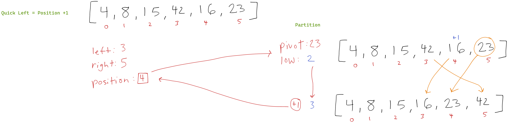
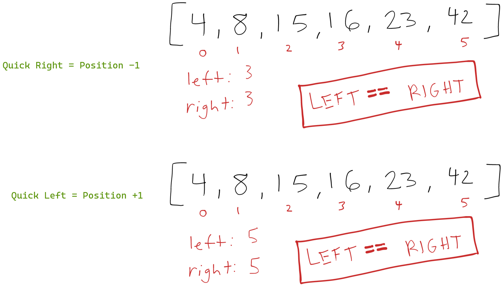

<style>
  img {
    max-width: 80%;
  }
</style>

# Quick Sort

The quick sort algorithm has two main parts, there is the recursive quickSort() itself that runs only if the left index has not overlapped with the right index. Each iteration through the partition function is called and then quickSort() is called twice again. The first inner quickSort() call sorts everything from the left to one less than the pivot position. The second inner quickSort() call sorts everything after the pivot position.

The partition() function is where the real work of the sorting is done. The inner workings of this partition() function will very depending on the technique used to find a pivot. In this example we will use whatever the value in the right index is at the time. 

An extra variable low is used to count how many elements are less than or equal to the pivot value. This value begins at one less than left. The loop in the partition() function begins at left and continues until and not including right. If the current value is less than or equal to the pivot, the low variable increments and the current value and the value at the position low are swapped.

After the iteration is complete a final swap is made between the value at low + 1 and right. This ensures there are no values larger than the pivot to its left.

The recursive quickSort() unwinds as indexes left and right overlap. Quick sort usually has a wrapper function to allow for a single array to be passed as an argument, the initial call uses 0 for left and the array length -1 for right.

## Pseudocode

```
ALGORITHM QuickSort(arr, left, right)
    if left < right
        // Partition the array by setting the position of the pivot value
        DEFINE position <-- Partition(arr, left, right)
        // Sort the left
        QuickSort(arr, left, position - 1)
        // Sort the right
        QuickSort(arr, position + 1, right)

ALGORITHM Partition(arr, left, right)
    // set a pivot value as a point of reference
    DEFINE pivot <-- arr[right]
    // create a variable to track the largest index of numbers lower than the defined pivot
    DEFINE low <-- left - 1
    for i <- left to right do
        if arr[i] <= pivot
            low++
            Swap(arr, i, low)

     // place the value of the pivot location in the middle.
     // all numbers smaller than the pivot are on the left, larger on the right.
     Swap(arr, right, low + 1)
    // return the pivot index point
     return low + 1

ALGORITHM Swap(arr, i, low)
    DEFINE temp;
    temp <-- arr[i]
    arr[i] <-- arr[low]
    arr[low] <-- temp
```

## Trace

Here is an example array we'll work through to show the process: `[8,4,23,42,16,15]`. Each image along the way will show what happens in each recursive call to the quickSort() function.

### Initial call to quickSort()

The initial call evaluates left (0) is less than right (5) and continues. Position is assigned by diving into the partition() function.

[](./images/quick-sort-blog/quick-sort-01.png)

#### Initial call to partition()

The pivot is declared as 15 (arr[5]) and low is set to -1. During the iteration from left (0) to right (5) swap() is called only the first two times making 8 swap with itself and 4 swap with itself. After the iteration low has increased to 1 and the second call to swap(), swaps 15 with 23 (arr[low + 1]). This leaves the array as `[8,4,15,42,16,23]`.

[](./images/quick-sort-blog/quick-sort-02.png)

### First Recursive Call to quickSort() with Right as Position - 1

Coming in with the right as position - 1 leaves left at 0 and right at 1. This satisfies the initial if test and we proceed by calling partition() again.

[](./images/quick-sort-blog/quick-sort-03.png)

#### Partitioning

The pivot is declared as 4 (arr[1]) and low is set at -1. Since 8 is not greater than or equal to 4 low does not increment and nothing is swapped during the iteration. The swap post iteration swaps 4 and 8 leaving the array as `[4,8,15,42,16,23]`.

[](./images/quick-sort-blog/quick-sort-04.png)

### Inner Pair of Recursive quickSort() Calls

QuickSort() is called again with right as position - 1 and does not continue because  left (0) is not less than right (-1). The next quickSort() call with left as position + 1 does also not continue because left (1) is not less than right (1).

[](./images/quick-sort-blog/quick-sort-05.png)

### First Recursive Call to quickSort() with Left as Position + 1

Now we are finally working with the elements to the right of the original pivot. Left is 3 and right is the end of the array 5. Since 3 is less than 5 we continue and call the partition() function.

[](./images/quick-sort-blog/quick-sort-06.png)

#### Partitioning

During this partition the pivot is 23 (arr[5]) and low is 2. The first step of the iteration 42 is not greater than or equal to 23 so we do not increment low. On the next round 16 is less than 23 so we increment low to 3 and swap 16 and 42 leaving the array as `[4,8,15,16,42,23]`. The iteration finishes and the post iteration swap(), swaps 23 and 42 leaving the array as `[4,8,15,16,23,42]`.

[](./images/quick-sort-blog/quick-sort-07.png)

### Another Inner Pair of Recursive quickSort() Calls

QuickSort() is called again with right as position - 1 and does not continue because  left (3) is not less than right (3). The next quickSort() call with left as position + 1 does also not continue because left (5) is not less than right (5).

[](./images/quick-sort-blog/quick-sort-08.png)

### Finish

QuickSort() finally reaches the end of its original call and exits the function. Nothing is returned but the array was sorted in place.

## Efficiency

- Time: O(N^2)
  - The time efficiency for quick sort will change depending on the chosen pivot and the data itself. On average the quick sort preforms with O(N log N) but oddly enough the worst case being an array that is already sorted will run with a time complexity of O(N^2).
- Space: O(N)
  - No other space is used beyond the stack frames required for recursion.

## Code 

```java
  public void quickSort(int[] arr) {
    quickHelper(arr, 0,arr.length - 1);
  }

  private void quickHelper(int[] arr, int left, int right) {
    if (left < right) {
      int position = partition(arr, left, right);
      quickHelper(arr, left, position - 1);
      quickHelper(arr, position +1, right);
    }
  }

  private int partition(int[] arr, int left, int right) {
    int pivot = arr[right];
    int low = left - 1;
    for (int i = left; i < right; i++) {
      if (arr[i] <= pivot)
        swap(arr, i, ++low);
    }
    swap(arr, right, low + 1);
    return low + 1;
  }

  private void swap(int[] arr, int i, int low) {
    int temp = arr[i];
    arr[i] = arr[low];
    arr[low] = temp;
  }
```
