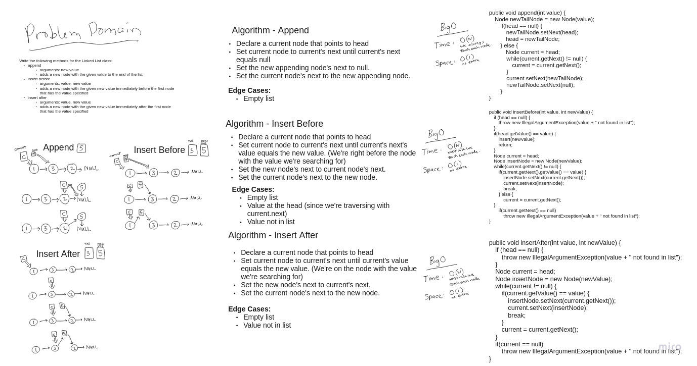

# Extending a Singly Linked List Implementation

Extend a singly linked list to include and "append", "insert before", and "insert after" method.

**Required Unit Tests**

1. Can successfully add a node to the end of the linked list
2. Can successfully add multiple nodes to the end of a linked list
3. Can successfully insert a node before a node located i the middle of a linked list
4. Can successfully insert a node before the first node of a linked list
5. Can successfully insert after a node in the middle of the linked list
6. Can successfully insert a node after the last node of the linked list

## Whiteboard Process

[](images/linked-list-insertions.jpg)

<style>
  img {
    max-width: 80%;
  }
</style>

## Approach & Efficiency

In each function we need to either traverse the whole linked list in the worst case, or the case of append we need to always traverse each node. Because of this the time complexity is O(N). The space complexity is O(1) because the extra space required to hold the variables that help traverse the nodes are negligible as the linked list grows.

- The time complexity of append could be improved to O(1) if I had implemented my linked list with a tail variable.

### Code

```java
  public void append(int value) {
    Node newTailNode = new Node(value);
    if(head == null) {
      newTailNode.setNext(head);
      head = newTailNode;
    } else {
      Node current = head;
      while(current.getNext() != null) {
        current = current.getNext();
      }
      current.setNext(newTailNode);
      newTailNode.setNext(null);
    }
  }

  public void insertBefore(int value, int newValue) {
    if (head == null) {
      throw new IllegalArgumentException(value + " not found in list");
    }
    if(head.getValue() == value) {
      insert(newValue);
      return;
    }
    Node current = head;
    Node insertNode = new Node(newValue);
    while(current.getNext() != null) {
      if(current.getNext().getValue() == value) {
        insertNode.setNext(current.getNext());
        current.setNext(insertNode);
        break;
      } else
      current = current.getNext();
    }
    if(current.getNext() == null)
      throw new IllegalArgumentException(value + " not found in list");
  }

  public void insertAfter(int value, int newValue) {
    if (head == null) {
      throw new IllegalArgumentException(value + " not found in list");
    }
    Node current = head;
    Node insertNode = new Node(newValue);
    while(current != null) {
      if(current.getValue() == value) {
        insertNode.setNext(current.getNext());
        current.setNext(insertNode);
        break;
      }
      current = current.getNext();
    }
    if(current == null)
      throw new IllegalArgumentException(value + " not found in list");
  }

  public void delete(int value) {
    if (head == null) {
      throw new IllegalArgumentException(value + " not found in list");
    }
    if (head.getValue() == value) {
      head = head.getNext();
      return;
    }
    Node current = head;
    while(current.getNext() != null) {
      if(current.getNext().getValue() == value) {
        current.setNext(current.getNext().getNext());
        return;
      }
      current = current.getNext();
    }
    if(current.getValue() == value)
      current = null;
    else
      throw new IllegalArgumentException(value + " not found in list");
  }
}


```

