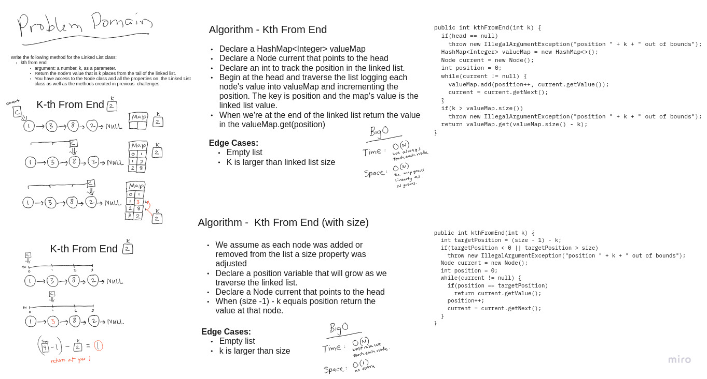

# Singly Linked List -- Kth from the End

Write a method extending the Linked List class to find the kth from the end value.

**int kthFromEnd(int k)**

**Required Unit Tests**

 1. Where k is greater than the length of the linked list
 2. Where k and the length of the list are the same
 3. Where k is not a positive integer
 4. Where the linked list is of a size 1
 5. “Happy Path” where k is not at the end, but somewhere in the middle of the linked list

## Whiteboard Process

[](images/linked-list-kth.jpg)

<style>
  img {
    max-width: 80%;
  }
</style>

## Approach & Efficiency

I implemented this method in two ways. In the first way I used a HashMap to store each value as I traversed the linked list. The current position (starting at 0) is the key for the value added to the map. The algorithm continues until the current node equals null. We then return the value in the HashMap with the key of the size of the HashMap minus k.

This implementation uses O(N) time complexity since we need to traverse the entire linked list, but accessing the map is O(1) so that step doesn't add any overhead. The space complexity is also O(N) because the size of the HashMap grows in proportion to N.

The second way I implemented kthFromEnd is by assuming the Linked List class holds a value "size" that is the number of nodes in the list. If we can count on a variable size then we only need to traverse the list until the position `(size - 1) - k`. At that point we can return the value.

In the worst case we're still using a time complexity of O(N) but the time complexity improves to O(1) because no extra data increases as N increases.


### Code

```java
public int kthFromEnd(int k) {
  if(head == null || k < 0)
    throw new IllegalArgumentException("position " + k + " out of bounds");
  HashMap<Integer, Integer> valueMap = new HashMap<>();
  Node current = new Node();
  current = head;
  int position = 0;
  while(current != null) {
    valueMap.put(position++, current.getValue());
    current = current.getNext();
  }
  if(k >= valueMap.size())
    throw new IllegalArgumentException("position " + k + " out of bounds");
  return valueMap.get((valueMap.size() - 1) - k);
  }

  // we can assume "size" is a class instance variable
  public int kthFromEndWithSize(int k) {
    int targetPosition = (size - 1) - k;
    if(k < 0 || targetPosition < 0 || targetPosition > size)
      throw new IllegalArgumentException("position " + k + " out of bounds");
    int output = 0;
    Node current = new Node();
    current = head;
    int position = 0;
    while(current != null) {
      if(position == targetPosition) {
        output = current.getValue();
        break;
      }
      position++;
      current = current.getNext();
    }
    return output;
  }
```
