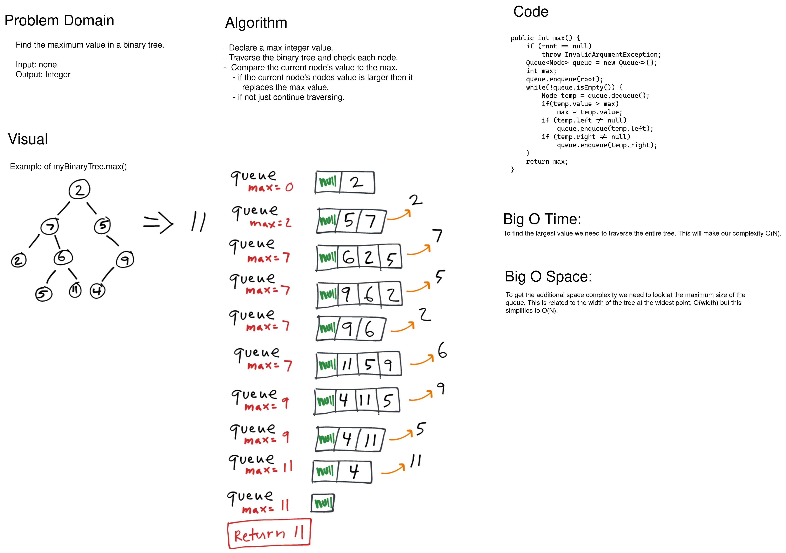

# Binary Trees -- Max Value

Write a method extending Binary Trees that returns the maximum value in a binary tree.

**int max()**

**Unit Tests**

 1. “Happy Path” The largest number is somewhere in the tree.
 2. The tree is empty.
 3. The tree has a single node.
 4. The highest value is the first value.
 5. The highest value is a leaf.

## Whiteboard Process

[](images/tree-max.png)

<style>
  img {
    max-width: 80%;
  }
</style>

## Approach & Efficiency

Since we can't assume the tree has been sorted we need to touch each node in the tree. Whether we use depth-first or breadth-first the time complexity will be O(N). For the space complexity I chose to use a breadth-first approach with a queue. The space complexity will be O(N) as well and it is related to the width of the widest point on the tree, this is the largest the queue will be during the iteration.


### Code

Whiteboard Code:
```java
public int max() {
    if (root == null)
        throw InvalidArgumentException;
    Queue<Node> queue = new Queue<>();
    int max = root.value;
    queue.enqueue(root);
    while(!queue.isEmpty()) {
        Node temp = queue.dequeue();
        if(temp.value > max)
            max = temp.value;
        if (temp.left != null)
            queue.enqueue(temp.left);
        if (temp.right != null)
            queue.enqueue(temp.right);
    }
    return max;
}
```

Generified Code:
```java
  public T max() {
    if (root == null)
      throw new IllegalArgumentException();
    Queue<Node<T>> queue = new Queue<>();
    queue.enqueue((Node<T>) root);
    T max = (T) root.value;
    while(!queue.isEmpty()) {
      Node<T> temp = queue.dequeue();
      if (temp.value.compareTo(max) > 0)
        max = temp.value;
      if ( temp.left != null)
        queue.enqueue(temp.left);
      if (temp.right != null)
        queue.enqueue(temp.right);
    }
    return max;
  }

```
